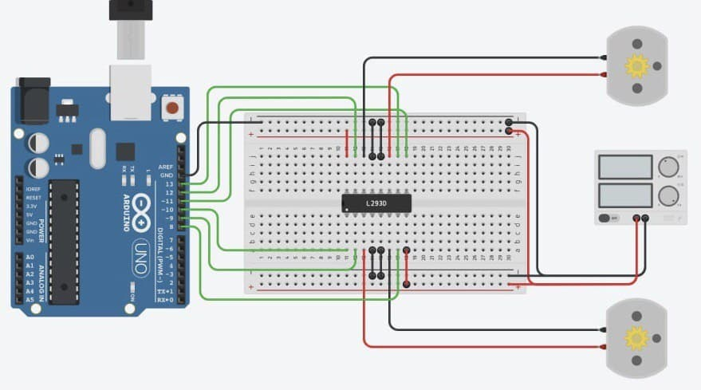
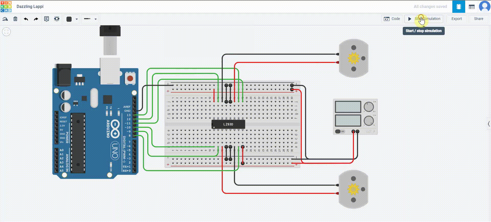

# H_bridge_l298
This project aims to design and program H-bridge l298.

## Installation guide:
  Firstly we need to use 5 componants (H-bridge l293, Arduino Uno R3, Breadboard, Power Supply, 2 DC Motors) 
  1. Plug H-bridge l293 into the center of breadboard between port 11 to 18.
  2. Plug positive wire in the power supply into the positive port in the both side of breadboard.
  3. Plug negative wire in the power supply into the ground port in the both side of breadboard.
  4. Plug top first pin (11) and bottom last pin (18) of H-bridge into positive port of breadboard.
  5. Plug top and bottom center pins (14,15) of H-bridge into ground port of breadboard.
  6. Plug top output3 & output4 to the motor1 and bottom output1 & output2 into 12,13,-9,8 pins in arduino.
  7. Plug top and bottom speed pins in H-bridge into minus pins in arduino -11,-10.

## Requirements:
  - Tinkercad

## Result

## Demo

